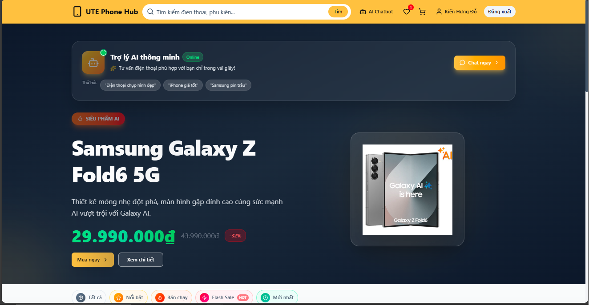

# UTE Phone Hub - Modern E-commerce Platform

**UTE Phone Hub** là một nền tảng thương mại điện tử chuyên kinh doanh điện thoại di động và phụ kiện, được xây dựng với kiến trúc **Monolithic (Modular)** hiện đại, tách biệt hoàn toàn giữa **Frontend (Next.js)** và **Backend (Spring Boot)** theo mô hình **BFF (Backend For Frontend)**.

Dự án được phát triển nhằm cung cấp trải nghiệm mua sắm trực tuyến mượt mà, bảo mật và hiệu năng cao, tích hợp các công nghệ tiên tiến nhất năm 2025-2026.

---

## 🚀 Công Nghệ Sử Dụng (Tech Stack)

### Backend (Server-side)
*   **Core**: Java 17, Spring Boot 3.5.8
*   **Security**: Spring Security 6, JWT (Stateless), OAuth2 (Google Login), BCrypt Hashing
*   **Database**: PostgreSQL 15 (Primary), Redis 7 (Caching, Session, Cart)
*   **ORM**: Spring Data JPA (Hibernate)
*   **API**: RESTful API, OpenAPI (Swagger) 3.0
*   **Infrastructure**: Docker, Docker Compose

### Frontend (Client-side)
*   **Framework**: Next.js 16.0.7 (App Router), React 19
*   **Language**: TypeScript 5
*   **Styling**: Tailwind CSS 4, Shadcn/UI (Radix UI)
*   **State Management**: Zustand
*   **Data Fetching**: Axios, SWR
*   **Animation**: Lucide Icons, Framer Motion

---

## 🏆 Những Thành Quả Đạt Được (Key Achievements)

Nhóm đã hoàn thiện một hệ thống thương mại điện tử hoàn chỉnh với các điểm nhấn công nghệ:

1.  **Kiến Trúc Hiện Đại**: Triển khai mô hình **BFF (Backend For Frontend)** giúp tối ưu hóa dữ liệu cho giao diện và tăng cường bảo mật bằng cách che giấu cấu trúc hệ thống phía sau.
2.  **Trải Nghiệm Người Dùng (UX) Đỉnh Cao**: Sử dụng **Next.js Server Components** và **Streaming SSR** để tối ưu hóa tốc độ tải trang (FCP < 1s). Giao diện được thiết kế theo chuẩn **Responsive** hoàn hảo trên mọi thiết bị.
3.  **Tích Hợp AI Chatbot**: Sử dụng **Gemini AI API** để xây dựng chatbot tư vấn sản phẩm thông minh, hỗ trợ khách hàng tìm kiếm và giải đáp thắc mắc 24/7.
4.  **Thanh Toán Trực Tuyến An Toàn**: Tích hợp thành công cổng thanh toán **VNPay Sandbox**, cho phép xử lý giao dịch thực tế qua mã QR và ngân hàng nội địa.
5.  **Tính Năng So Sánh Sản Phẩm**: Xây dựng module so sánh cấu hình phần cứng (RAM, ROM, Chip, Pin) trực quan, giúp người dùng dễ dàng đưa ra quyết định mua sắm.
6.  **Tra Cứu & QR Code**: Hệ thống tự động tạo **Mã QR** cho mỗi đơn hàng, hỗ trợ khách hàng tra cứu trạng thái nhanh chóng mà không cần đăng nhập.

---

## ✨ Tính Năng Chính (Features)

### 👤 Phân Hệ Khách Hàng (User)
*   **Xác thực đa năng**: Đăng ký truyền thống, đăng nhập nhanh qua **Google OAuth2**, quản lý profile và sổ địa chỉ.
*   **Mua sắm thông minh**: Tìm kiếm nâng cao (Autocomplete), bộ lọc cấu hình chi tiết, so sánh sản phẩm.
*   **Giỏ hàng & Thanh toán**: Giỏ hàng lưu trữ linh hoạt (Redis), áp dụng Voucher giảm giá, thanh toán VNPay/COD.
*   **Hậu mãi**: Đánh giá sản phẩm (kèm ảnh), theo dõi đơn hàng qua Timeline, quét QR đơn hàng.

### 🛡️ Phân Hệ Quản Trị (Admin)
*   **Dashboard Real-time**: Thống kê doanh thu, đơn hàng, người dùng mới qua biểu đồ trực quan.
*   **Quản lý Catalog**: Toàn quyền CRUD Sản phẩm (JSON Attributes), Danh mục, Thương hiệu.
*   **Vận hành**: Quản lý kho, xử lý đơn hàng đa trạng thái, quản lý mã khuyến mãi (Voucher).
*   **Kiểm soát**: Phân quyền người dùng (Role-based), kiểm duyệt đánh giá khách hàng.

---

## 👥 Đội Ngũ Phát Triển (Development Team)

Dự án được thực hiện bởi nhóm sinh viên lớp **CNPM HK5 @ HCMUTE**:

| Thành viên | Phụ trách Module | Công việc chính |
| :--- | :--- | :--- |
| **Đỗ Kiến Hưng** | **Project Manager** & M01, M08 | JWT Auth, Google OAuth2, Product Reviews & Ratings. |
| **Võ Đức Hoàng** | M02 - Quản lý Sản phẩm | CRUD Product, Image Upload, Soft Delete. |
| **Huỳnh Ngọc Thạch** | M03 - Danh mục & Thương hiệu | Category & Brand Management, Business Constraints. |
| **Trần Quốc Giăng** | M04 - Khám phá Sản phẩm | Product Comparison, Recommendations, AI Lead. |
| **Lưu Trần Kim Phú** | M05 - Giỏ hàng (Redis) | Redis Cart, Syncing, Real-time updates. |
| **Huỳnh Hữu Huy** | M06, M07 - Thanh toán & Đơn hàng | VNPay Integration, Checkout, Order Tracking (Public/Guest). |
| **Nguyễn Văn Quang Duy** | M09 - Khuyến mãi | Voucher Engine, Campaign Management. |
| **Trần Thị Thanh Trang** | M10 - Admin Dashboard | Statistical Charts, User Management, Analytics. |

---

## 📖 Tài Liệu Phát Triển

Để biết cách cài đặt, chạy dự án và các quy chuẩn đóng góp, vui lòng xem:

👉 **[TÀI LIỆU PHÁT TRIỂN & CHẠY DỰ ÁN (DEVELOPMENT.md)](DEVELOPMENT.md)**

---

## 📝 License

Dự án này được bảo hộ bởi giấy phép [MIT](LICENSE).

---
**UTE Phone Hub Team** - *CNPM HK5 @ HCMUTE*
