# HƯỚNG DẪN VẼ SEQUENCE DIAGRAM - MODULE 01 (AUTHENTICATION & USER)

Tài liệu này mô tả chi tiết luồng dữ liệu, các lời gọi hàm, các khối điều khiển (Alt, Opt, Ref) và **kiểu dữ liệu trả về** trong code backend để hỗ trợ việc vẽ Sequence Diagram chuẩn UML.

## Ký hiệu và Quy ước
- **Actor**: Người dùng cuối (User/Admin).
- **View (UI)**: Giao diện người dùng (React Page/Component) - nơi kích hoạt hành động.
- **Controller**: Endpoint hứng request từ UI.
- **Participants**: Controller, Service, Repository, Component, External...
- **Main Sequence**: Luồng chính.
- **Return Type**: Kiểu dữ liệu trả về.

---

## 1. Đăng ký Tài khoản (Register)
**Use Case:** `UC-M01-01`
**Endpoint:** `POST /api/v1/auth/register`

**Participants:**
- **Actor**: User
- **View**: `RegisterPage`
- **Controller**: `AuthController`
- **Service**: `AuthServiceImpl`
- **Repo**: `UserRepository`, `CartRepository`
- **Component**: `PasswordEncoder`, `UserMapper`
- **External**: `EmailService`

**Sequence Flow:**
1. **Actor** -> **View**: Click "Đăng ký" (`submitForm`)
2. **View** -> **Controller**: Call API `register(RegisterRequest)`
3. **Controller** -> **Service**: `register(RegisterRequest)`
4. **Service** thực hiện validation:
    - **[Alt]** `password != confirmPassword`:
        - **Service** -> **Controller**: Throw `BadRequestException`
    - **[Alt]** `userRepository.existsByEmail(email)` == true:
        - **Service** -> **Controller**: Throw `ConflictException`
    - **[Alt]** `userRepository.existsByUsername(username)` == true:
        - **Service** -> **Controller**: Throw `ConflictException`
5. **Service** -> **Component**: `passwordEncoder.encode(password)` -> return `String`
6. **Service**: Create `User` entity (Status=ACTIVE, Role=CUSTOMER)
7. **Service** -> **Repo**: `userRepository.save(user)` -> return `User`
8. **Service**: Create `Cart` entity
9. **Service** -> **Repo**: `cartRepository.save(cart)` -> return `Cart`
10. **[Ref]** Gọi luồng gửi email:
    - **Service** -> **External**: `emailService.sendRegistrationEmail(email, fullName)`
    - **External** --> **Service**: return `void` (Async)
      *(Xem chi tiết tại mục 8.1)*
11. **Service** -> **Component**: `userMapper.toResponse(user)` -> return `UserResponse`
12. **Service** --> **Controller**: return `UserResponse`
13. **Controller** --> **View**: return `ResponseEntity` (201 Created)
14. **View** --> **Actor**: Show success message & Redirect to Login

### Mermaid Code
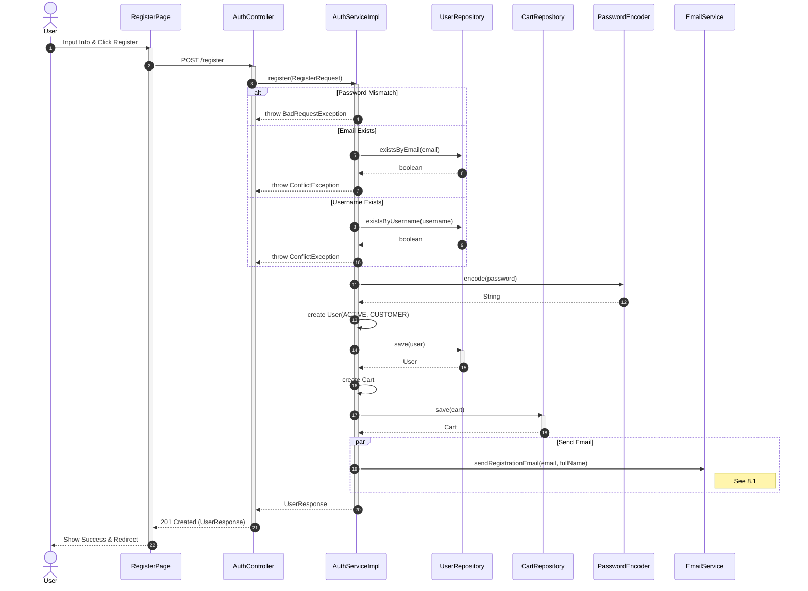

---

## 2. Đăng nhập (Login)
**Use Case:** `UC-M01-02`
**Endpoint:** `POST /api/v1/auth/login`

**Participants:**
- **Actor**: User
- **View**: `LoginPage`
- **Controller**: `AuthController`
- **Service**: `AuthServiceImpl`
- **Repo**: `UserRepository`
- **Component**: `PasswordEncoder`, `JwtTokenProvider`
- **Cache**: `RedisTemplate`

**Sequence Flow:**
1. **Actor** -> **View**: Input Credentials & Click "Login"
2. **View** -> **Controller**: Call API `login(LoginRequest)`
3. **Controller** -> **Service**: `login(LoginRequest)`
4. **Service** -> **Repo**: `findByEmail(usernameOrEmail)` OR `findByUsername`
5. **Repo** --> **Service**: return `Optional<User>`
6. **[Alt]** User not found:
    - **Service** -> **Controller**: Throw `UnauthorizedException`
7. **[Alt]** Valid user found:
    - **[Opt]** `status == LOCKED`: Throw `UnauthorizedException`
    - **[Opt]** `status != ACTIVE`: Throw `UnauthorizedException`
    - **[Alt]** Password Mismatch:
        - **Service** -> **Controller**: Throw `UnauthorizedException`
    - **[Else]** Password Match:
        - **Service** -> **Component**: `generateAccessToken` -> `String`
        - **Service** -> **Component**: `generateRefreshToken` -> `String`
        - **Service** -> **Cache**: `opsForValue().set(...)` -> `void`
        - **Service** --> **Controller**: return `AuthResponse`
8. **Controller** --> **View**: return `ResponseEntity` (AuthResponse)
9. **View** --> **Actor**: Redirect to Homepage / Dashboard

### Mermaid Code
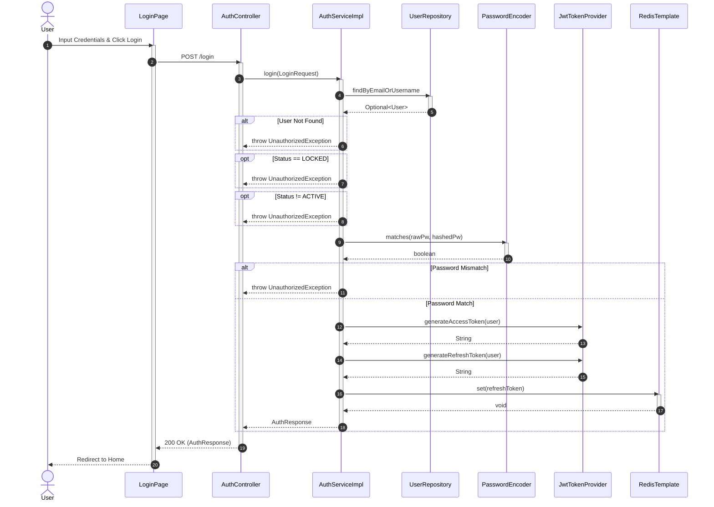

---

## 3. Đăng nhập Google (OAuth2)
**Use Case:** `UC-M01-03`
**Trigger:** Google OAuth2 Callback

**Participants:**
- **Actor**: User
- **View**: `LoginPage`
- **External**: Google, Spring Security Filter Chain
- **Service**: `CustomOidcUserService`
- **Repo**: `UserRepository`, `CartRepository`
- **Handler**: `OAuth2AuthenticationSuccessHandler`

**Sequence Flow:**
1. **Actor** -> **View**: Click "Login with Google"
2. **View** -> **External**: Redirect to Google Auth
3. **Actor** -> **External**: Consent & Login
4. **External** -> **System**: Callback with Code
5. **System** -> **External**: Exchange Tokens
6. **System** -> **Service**: `loadUser(OidcUserRequest)`
7. **Service** -> **Repo**: `findByEmail(email)`
8. **[Alt]** User Exists (**Case A**):
    - **[Opt]** `LOCKED`: Throw Exception
    - **Service** --> **System**: return `OidcUser`
9. **[Alt]** New User (**Case B**):
    - **Service**: Create User & Cart
    - **Service** -> **Repo**: `userRepository.save()` -> `User`
    - **Service** -> **Repo**: `cartRepository.save()` -> `Cart`
    - **Service** --> **System**: return `OidcUser`
10. **System** -> **Handler**: `onAuthenticationSuccess(...)`
11. **Handler** -> **Component**: Generate Tokens -> `String`
12. **Handler** -> **Cache**: Save Refresh Token -> `void`
13. **Handler** --> **View**: Redirect to Frontend URL (with params)
14. **View** --> **Actor**: Login Success

### Mermaid Code
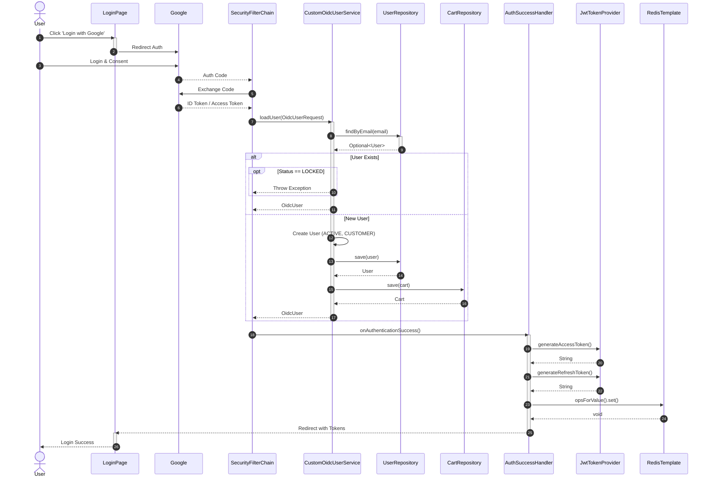

---

## 4. Quên Mật khẩu (Forgot Password)

### 4.1. Yêu cầu OTP (Request)
**Endpoint:** `POST /api/v1/auth/forgot-password/request`
**View**: `ForgotPasswordPage`

1. **Actor** -> **View**: Input Email & Submit
2. **View** -> **Controller**: Call API `requestPasswordReset(email)`
3. **Controller** -> **Service**: `requestPasswordReset(email)`
4. **Service** -> **Repo**: `findByEmail(email)` -> `Optional<User>`
5. **[Alt]** Not Found: Return Silent
6. **[Else]** Found:
    - **Service** -> **Component**: Generate OTP -> `String`
    - **Service** -> **Cache**: Save OTP -> `void`
    - **[Ref]** Gọi luồng gửi email:
        - **Service** -> **External**: `emailService.sendOtpEmail(email, otp)`
        - **External** --> **Service**: return `void`
          *(Xem chi tiết mục 8.2)*
7. **Controller** --> **View**: return `ResponseEntity` (200 OK)
8. **View** --> **Actor**: Show "Check Email" Message

### Mermaid Code
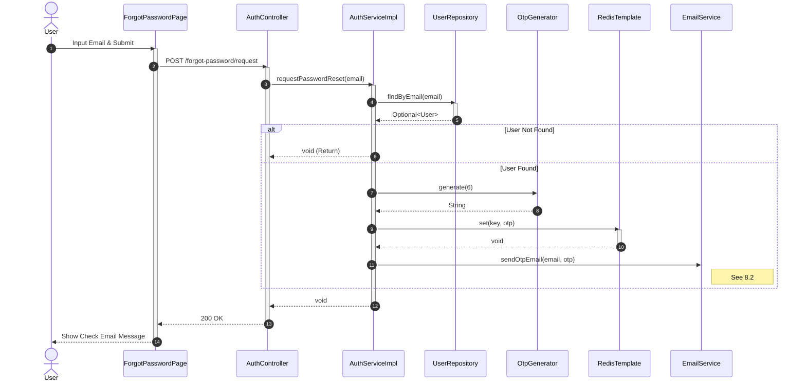

### 4.2. Xác thực & Đổi mật khẩu (Reset)
**Endpoint:** `POST /api/v1/auth/forgot-password/reset`
**View**: `ResetPasswordPage`

1. **Actor** -> **View**: Input OTP & New Password
2. **View** -> **Controller**: Call API `verifyOtpAndResetPassword`
3. **Controller** -> **Service**: `verifyOtpAndResetPassword`
4. **Service** -> **Cache**: Get OTP -> `String`
5. **[Alt]** Invalid OTP: Throw `BadRequestException`
6. **[Else]** Valid:
    - **Service** -> **Repo**: `findByEmail` -> `Optional<User>`
    - **Service** -> **Component**: Encode PW -> `String`
    - **Service** -> **Repo**: Save User -> `User`
    - **Service** -> **Cache**: Delete OTP -> `Boolean`
    - **[Ref]** Send Confirm Email
7. **Controller** --> **View**: return `ResponseEntity` (200 OK)
8. **View** --> **Actor**: Show Success & Redirect Login

### Mermaid Code
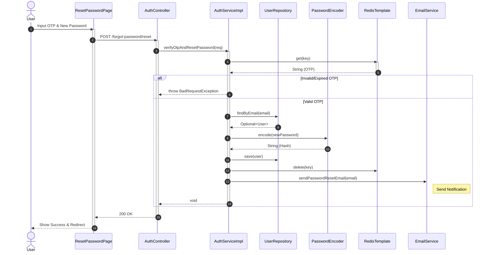

---

## 5. Đăng xuất (Logout)
**Use Case:** `UC-M01-04`
**Endpoint:** `POST /api/v1/auth/logout`

1. **Actor** -> **View**: Click "Logout"
2. **View** -> **Controller**: Call API `logout`
3. **Controller** -> **Service**: `logout(request)`
4. **Service** -> **Cache**: `delete(token)` -> `Boolean`
5. **Controller** --> **View**: return `200 OK`
6. **View** --> **Actor**: Redirect to Login

### Mermaid Code
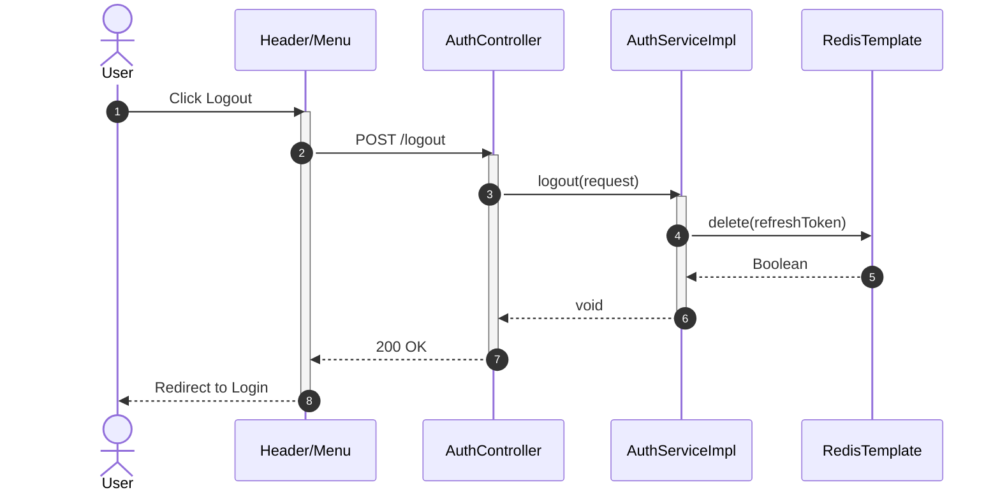

---

## 6. Cập nhật Hồ sơ (Update Profile)
**Use Case:** `UC-M01-06`
**Endpoint:** `PUT /api/v1/user/profile`

1. **Actor** -> **View**: Edit Info & Save
2. **View** -> **Controller**: Call API `updateProfile`
3. **Controller** -> **Service**: `updateProfile`
4. **Service** -> **Repo**: `findById` -> `Optional<User>`
5. **[Alt]** Not Found: Throw Exception
6. **Service**: Update Fields
7. **Service** -> **Repo**: `save(user)` -> `User`
8. **Service** -> **Component**: Map info -> `UserResponse`
9. **Controller** --> **View**: return `UserResponse`
10. **View** --> **Actor**: Update UI Info

### Mermaid Code
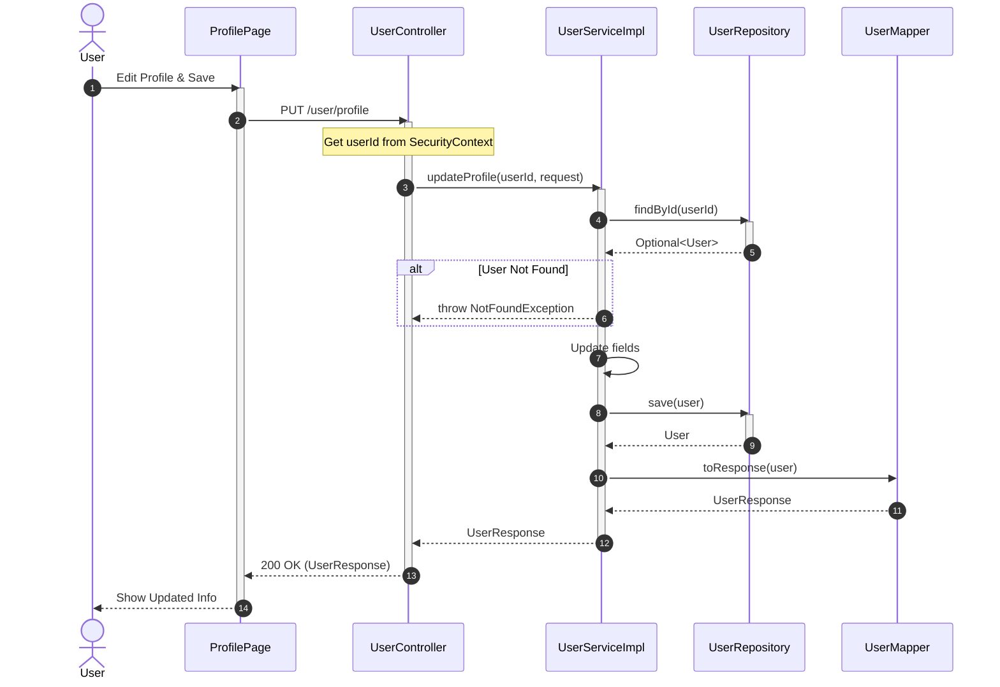

---

---

## 7. Quản lý Địa chỉ Giao hàng (Manage Addresses)
**Use Case:** `UC-M01-07`
**Participants:**
- **Actor**: User
- **View**: `AddressPage`
- **Controller**: `AddressController`
- **Service**: `AddressServiceImpl`
- **Repo**: `AddressRepository`
- **Util**: `SecurityUtils`

### 7.1. Lấy danh sách địa chỉ
**Endpoint:** `GET /api/v1/user/addresses`

1. **Actor** -> **View**: View Addresses
2. **View** -> **Controller**: Call API `getAddresses`
3. **Controller** -> **Util**: `getCurrentUserId()` -> `Long`
4. **Controller** -> **Service**: `getUserAddresses(userId)`
5. **Service** -> **Repo**: `findByUserId(userId)` -> `List<Address>`
6. **Service** -> **Component**: Map to DTO -> `List<AddressResponse>`
7. **Controller** --> **View**: return `List<AddressResponse>`
8. **View** --> **Actor**: Display List

#### Mermaid Code
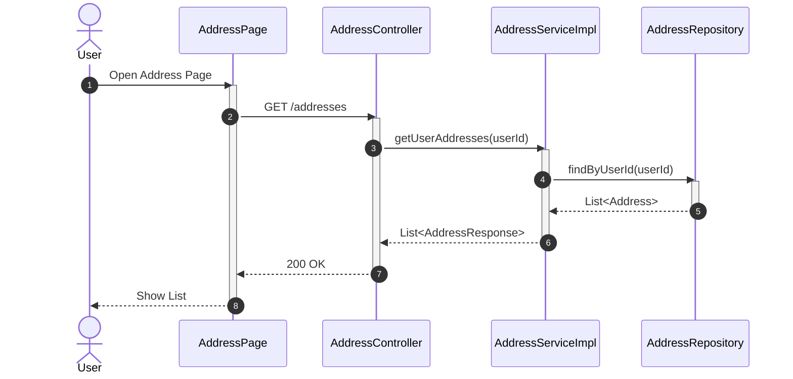

### 7.2. Thêm mới / Cập nhật / Xóa / Mặc định (CRUD)
*(Mô tả chung cho các thao tác ghi)*
**Endpoint:** `POST, PUT, DELETE /api/v1/user/addresses`

1. **Actor** -> **View**: Perform Action (Add/Edit/Delete)
2. **View** -> **Controller**: Call API
3. **Controller** -> **Service**: Call Method (`create`, `update`, `delete`, `setDefault`)
4. **Service**: Business Logic (Check Limit, Check Exists)
5. **Service** -> **Repo**: Save/Delete Entity
6. **Controller** --> **View**: return Response
7. **View** --> **Actor**: Update UI

#### Mermaid Code (Create Address Example)
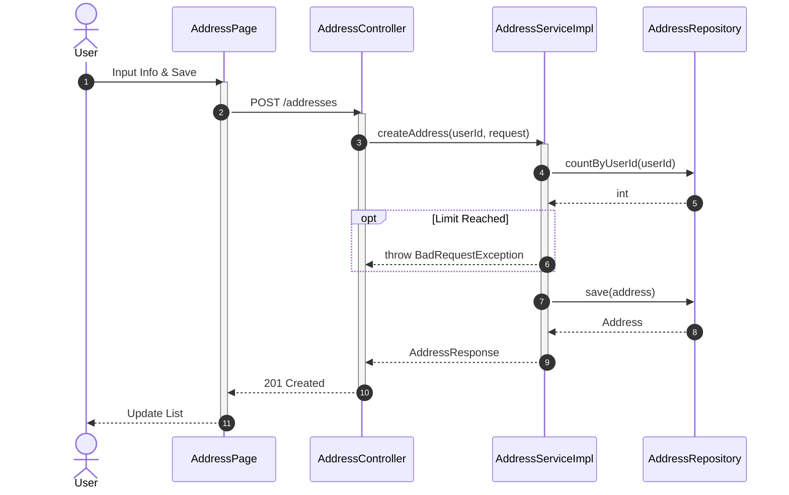

---

## 8. Các Luồng phụ (Reference Flows)

### 8.1. Gửi Email Chào mừng
**Method:** `EmailService.sendRegistrationEmail(email, fullName)`
**ReturnType:** `void`

1. **AuthService** -> **EmailService**: `sendRegistrationEmail(...)`
2. **EmailService**: Prepare `Context`
3. **EmailService**: `templateEngine.process(...)` -> return `String` (HTML)
4. **EmailService** -> **JavaMailSender**: `createMimeMessage()` -> return `MimeMessage`
5. **EmailService** -> **JavaMailSender**: `send(message)` -> return `void`

#### Mermaid Code
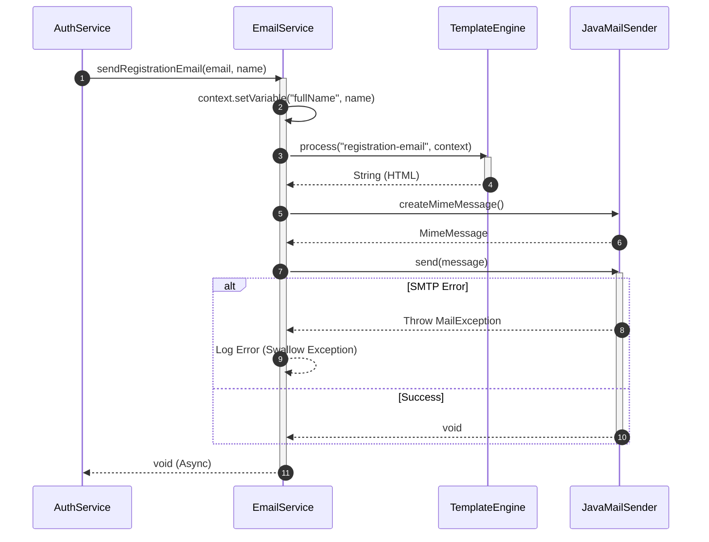

### 8.2. Gửi Email OTP
**Method:** `EmailService.sendOtpEmail(email, otp)`
**ReturnType:** `void`

1. **AuthService** -> **EmailService**: `sendOtpEmail(...)`
2. **EmailService**: Prepare `Context`
3. **EmailService**: `templateEngine.process(...)` -> return `String` (HTML)
4. **EmailService** -> **JavaMailSender**: `send(message)` -> return `void`

#### Mermaid Code
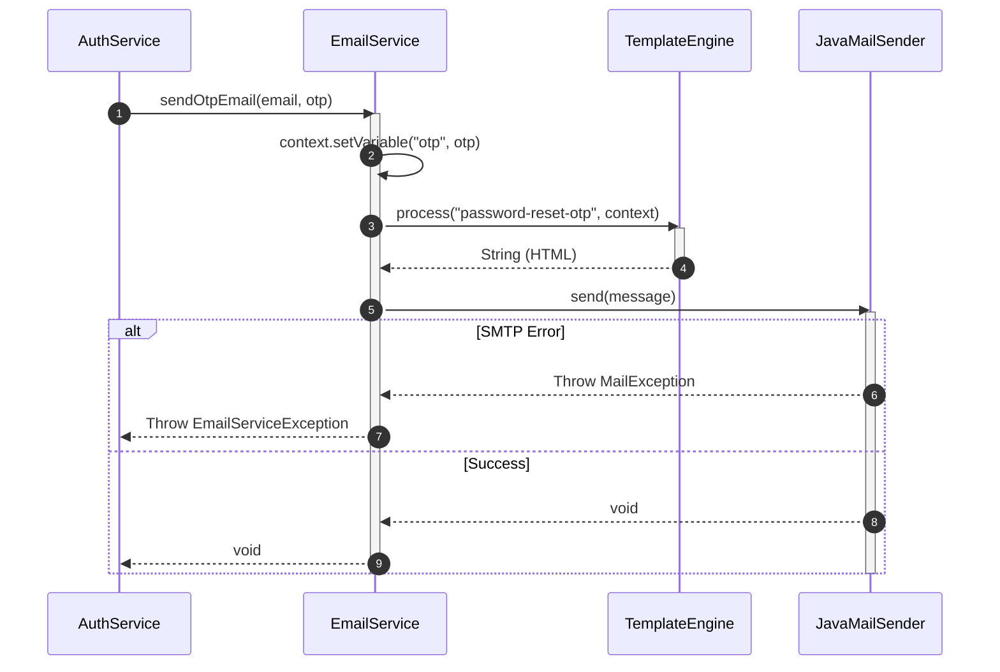

### 8.3. Gửi Email Thanh toán Thành công
**Method:** `EmailService.sendOrderPaymentSuccessEmail(...)`
**ReturnType:** `void`

1. **Caller** -> **EmailService**: `sendOrderPaymentSuccessEmail`
2. **EmailService**: `templateEngine.process(...)` -> return `String` (HTML)
3. **EmailService** -> **JavaMailSender**: `send(message)` -> return `void`

#### Mermaid Code
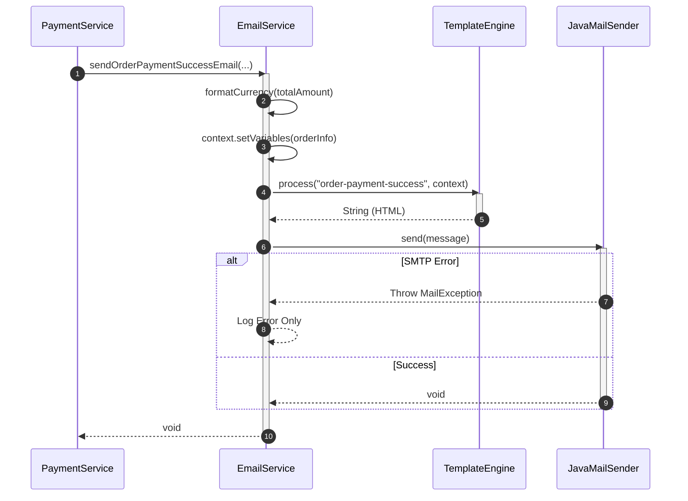
